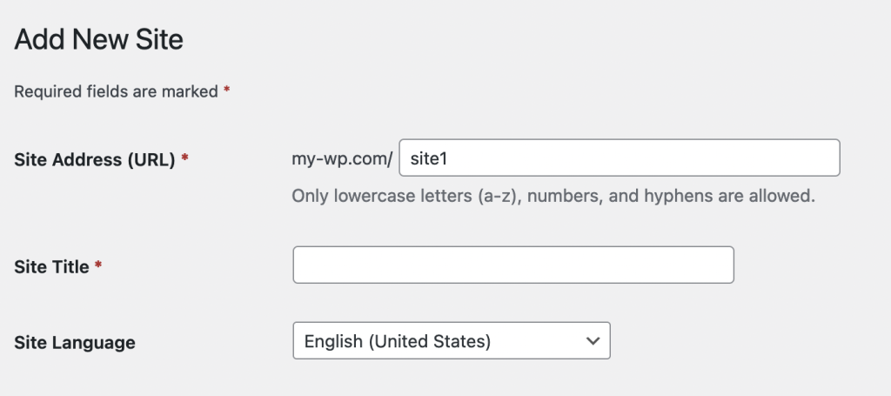
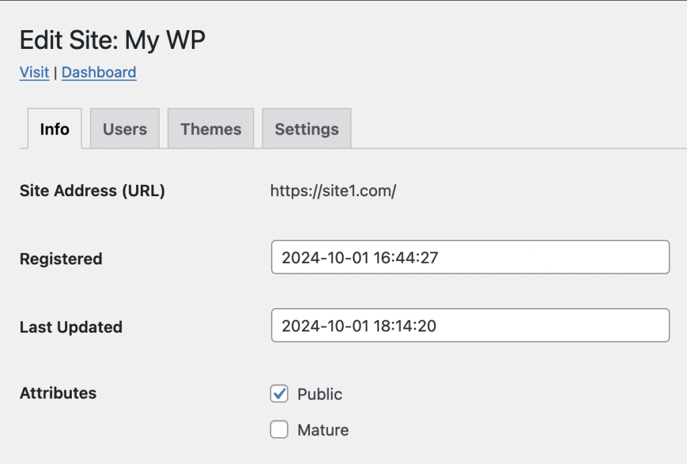

I've been using Ionos webhosting for 17 years, dating back to when it was still **1and1**. In 2007, the service offered a good mix of features and affordability. However, over the years it has become bloated with unnecessary tools, and the price has skyrocketed. It was time to switch.

Currently, I need simple WordPress hosting for a handful of sites. Commercial WordPress hosting is a bit more expensive than I was hoping, considering how easy it is to do yourself. I though "Hey, I know how to do this stuff!"

I've been hearing good things about [Hetzner](https://www.hetzner.com/) VPSs and decided to go all-in on self-hosting. My goal was to run a single WordPress Multisite instance, with separate domains for each site.

I chose the Hetzner CX22 instance, which can be deployed with a preconfigured WordPress image, eliminating the need to manually install the LAMP stack. The image includes certbot for automatic provisioning of Let's Encrypt SSL certificates. After provisioning the server and migrating my domain to Porkbun, I logged in and was immediately launched into a WordPress setup script, which configured the site details and SSL for the primary domain.

## Security & Maintenance

Next, I took some basic security measures by requiring SSH key authentication and enabling UFW (Uncomplicated Firewall). Hetzner’s setup process adds SSH keys automatically, so I simply disabled password authentication by setting `PasswordAuthentication no` in `/etc/ssh/sshd_config`.

The UFW setup involved:

```bash
ufw default deny incoming  # Block all incoming traffic by default
ufw allow OpenSSH          # Allow SSH connections
ufw allow https            # Allow secure HTTPS traffic
ufw allow http             # Allow HTTP traffic for Let's Encrypt
ufw enable                 # Enable the firewall

```

The server image includes `unattended-upgrades`, but I made a few adjustments to `/etc/apt/apt.conf.d/50unattended-upgrades` to automatically remove unused dependencies and email me on errors.

Quite a few packages needed updates, so I ran my go-to commands:

```bash
apt update
apt upgrade
apt autoremove
reboot

```

And a reboot at the end to apply kernel updates. I also signed up for [Canonical's LivePatch](https://auth.livepatch.canonical.com/) service to keep the kernel updated without reboots.

## Additional Sites

Adding additional sites requires configuring additional Apache vhosts and obtaining SSL certificates for each domain.

### vhost Setup

The setup script that runs on your first login will attempt to provision a SSL cert, but you can manually trigger that process by running `certbot --apache`. This will scan your apache vhosts for a list of domains to register. After the cert is created, it will add the necessary config to your vhosts.

To set up additional vhosts, navigate to `/etc/apache2/sites-enabled` and duplicate the two “default” files. Replace the domain name values, then remove the existing SSL configuration (i.e., `SSLCertificateFile`, `SSLCertificateKeyFile`, and `Include /etc/letsencrypt/options-ssl-apache.conf` lines).

Once the new vhosts are configured, we run `certbot --apache` to request the new certs. Finally, we restart apache with `systemctl restart apache2`.

### WordPress Sites

Enabling WordPress Multisite features is [well-documented](https://learn.wordpress.org/tutorial/introduction-to-wordpress-multisite-networks/). However, setting up separate domains for each site is less straightforward. While the default options include subdomains (e.g., `site1.my-wp.com`) and subdirectories (e.g., `my-wp.com/site1`), you can easily configure separate domains. During the Multisite setup, choose **subdirectories**.

You can then create new sites with subdirectory URLs:

Next, edit the site settings to change the URL to the new domain. Easy!

Overall, the process was easier than expected, and I’m pleased with the added control over my hosting setup. Best of all, it’s about a quarter of the cost of Ionos.
